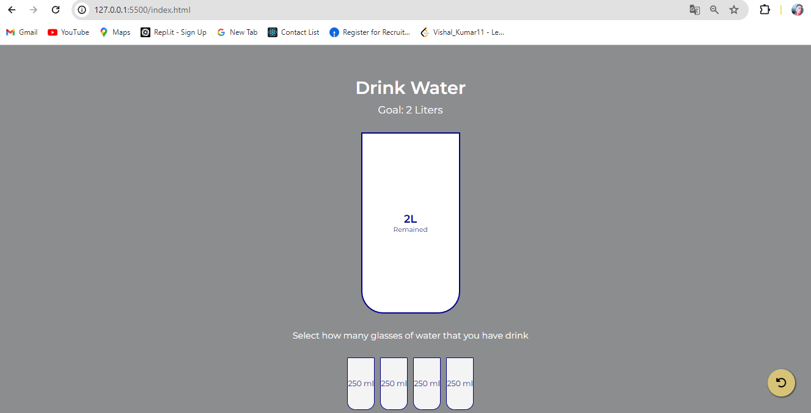

# Drink Water

<p align="justify">A simple web application to track daily water intake and encourage hydration by visualizing progress towards a 2-liter daily goal.</p>

## Description

<p align="justify">This project helps users track their daily water intake by selecting the number of 250ml glasses they have consumed. It displays the remaining amount needed to reach the daily goal and the percentage of the goal achieved.</p>

## Features

- Visual representation of water intake with small cups and a large cup.
- Real-time update of the remaining water and percentage of goal achieved.
- Responsive design for various screen sizes.

## Usage

To use the Drink Water tracker:

1. Open the `index.html` file in your web browser.
2. Click on the small cups to indicate the number of 250ml glasses of water you have consumed.
3. The large cup will update to show the percentage of your 2-liter goal achieved and the amount remaining.

## Files

- `index.html`: Contains the HTML structure of the application.
- `style.css`: Contains the CSS styles for the application.
- `script.js`: Contains the JavaScript logic for updating the water intake visualization.
- `README.md`: This file, providing information about the project.

## Dependencies

This project uses Font Awesome for icons, included via CDN:

```html
<link rel="stylesheet" href="https://cdnjs.cloudflare.com/ajax/libs/font-awesome/6.1.1/css/all.min.css" integrity="sha512-KfkfwYDsLkIlwQp6LFnl8zNdLGxu9YAA1QvwINks4PhcElQSvqcyVLLD9aMhXd13uQjoXtEKNosOWaZqXgel0g==" crossorigin="anonymous" referrerpolicy="no-referrer" />
```

## JavaScript Logic
- ##### The JavaScript (script.js) is responsible for:
   - Adding event listeners to the small cups.
   - Highlighting the selected cups.
   - Updating the large cup to show the percentage of the goal achieved and the amount of water remaining.

## Key Functions
- highlightCups(idx): Highlights the cups up to the selected index and updates the large cup.
- updateBigCup(): Updates the large cup based on the number of highlighted cups.

### License

<p align="justify">This README provides an overview of the project, instructions on how to use it, a description of the files and dependencies, an explanation of the JavaScript logic, and guidelines for contributing and licensing.</p>

## Output Screen

- #### Empty Glass


- #### 20% water fill up in glass


- #### 50% water fill up in glass


- #### 100% water fill up in glass

